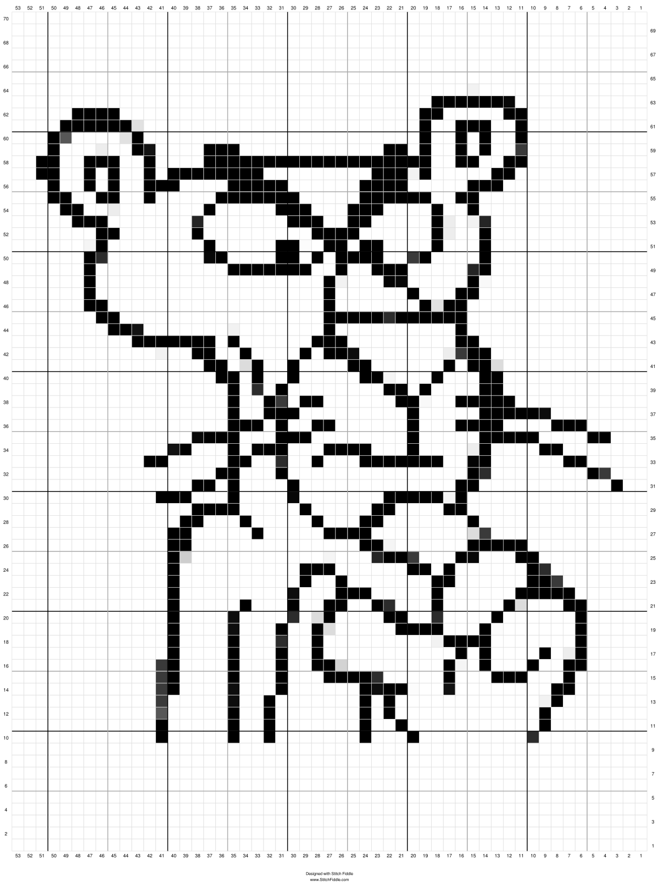

# Clase 03

Recuerdo de mi primera clase tomando apuntes en github y no en papel.

FORK (tenedor): te crea una copia de un repositorio ajeno, puedes estar sincronizado, estar adelantado o atrasado con respecto al repositorio principal. Si te atrasas puedes sincronizarlo.

## imagenes
Para subir imágenes debemos crear una carte aparte, la cual debe contener las imágenes que queremos. Luego debemos rutearla (en nuestro readme) con el siguiente código

```

```


