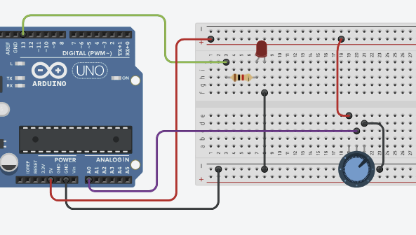

# Clase 04
La clase de hoy utilizaremos:
- leds
- potenciómetro
- protoboard
- resistencia de 1k ohm de código de color: café-negro-rojo-dorado

### Led
el led tiene una polaridad, la patita más larga es ánodo (positivo) y la más corta es cátodo (negativo)

### Potenciómetro
Es un aparato que nos permite regular la energía que recibe un circuito, a diferencia de la resistencia, este lo hace de manera variable


### Resistencia
hay varios tipos de resistencias, nosotros usaremos la de 1k ohm, que su código de color es café-negro-rojo-dorado
la resistencia restringe el paso de la energía.

### Protoboard
Comenzamos a conectar nuestros componentes en nuestra protoboard
acá dejo el esquema que seguimos para conectarlo
(esquema subido por misaaaaaa)


## Mi primer potenciómetro
Aquí está el código que usamos en la clase para comenzar
a usar nuestro potenciómetro
(subido por Misaaaaaa)

```
int potPin = A0;
//creamos una variable donde se va a guardar
//lo que mida nuestro potenciometro
//y lo inicializamos en 0
int valorPot = 0; 

void setup()
{
	Serial.begin(9600);  
}

void loop()
{
  //queremos que valorPot sea dependiente
  //de la lectura del potenciometro
  //que esta conectado en A0;
  	valorPot = analogRead(potPin);
  //para los Analog IN, no tengo que decir
  //que son INPUTS
	Serial.println(valorPot);
}
```

## Función map
La función map() convierte un número de un rango
a otro rango diferente
aquí el código usado en clase (subido por Misaaaaaa)

```
int potPin = A0;

int valorPot = 0; 

//vamos a guardar la variable del nuevo
//rango del potenciometro
int potMapeado = 0;

void setup()
{
	Serial.begin(9600);  
}

void loop()
{

  	valorPot = analogRead(potPin);
  	//guardamos el mapeo en la variable potMapeado
  //con la función map(); que funciona así 
  //map(valorAConvertir, minimoInicial,maximoInicial,minimoFinal,maximoFinal);
  	potMapeado = map(valorPot,0,1023,0,100);

	Serial.println(potMapeado);
}
```
en este código lo que hacemos es que 
```
potMapeado = map(valorPot,0,1023,0,100);
```
hace que el valor del potenciómetro (qué tanta energía pasa al circuito)
se convierta al valor de milésimas de segundos 
0 energía = 0 milisegundos
1023 energía = 100 milisegundos

### Led potenciómetro con delay
Podemos usar nuestro led y regularlo con el potenciómetro, usando delay
aquí el código usado en clases 
(subido por Misaaaaaa)

```
int potPin = A0;
int ledPin = 7;
int valorPot = 0; 
int potMapeado = 0;
//variable para controlar el tiempo de parpadeo
int tiempoParpadeo = 100;

void setup()
{
  	//pin 7 va a ser una salida
  	pinMode(ledPin,OUTPUT);
	Serial.begin(9600);  
}

void loop()
{

  	valorPot = analogRead(potPin);
  	//cambiamos la velocidad de parpadeo
  //de 100 a 2000 ms
  	potMapeado = map(valorPot,0,1023,100,2000);
  
  //vamos a usar para controlar el tiempo, potMapeado
  
  tiempoParpadeo = potMapeado;
  
  	//vamos a hacer el blink aquí
  	digitalWrite(ledPin, HIGH);
  	delay(tiempoParpadeo);
  	digitalWrite(ledPin, LOW);
  	delay(tiempoParpadeo);

	Serial.println(tiempoParpadeo);
}
```
El problema con el delay es solo puede hacer una cosa
por ejemplo: si el potenciómetro está en 1023 y eso equivale a 2000 milisegundos
si bajamos nuestro potenciómetro a 0, el led no se apagará hasta que se cumpla el 
tiempo de 2000 milisegundos.
si queremos que esa variación sea continua, usamos lo siguiente

### Millis (led sin delay)
el millis es una función que puede trabajar con más de una tarea en paralelo
por lo que le podemos pedir que mantenga el led encendido
por la cantidad de milisegundos que diga el potenciometro
pero además podemos pedirle que esté monitoreando si el potenciómetro ha indicado una variabilidad
en los milisegundos, por lo que a penas nosotros movemos el potenciómetro
el led reacciona inmediatamente, cambiando su intervalo de encendido

Aquí el código que utilizamos en clases
(subido por Misaaaaaa)

```
int ledPin = 7;
int potPin = A0;
int valorPot = 0; 
int potMapeado = 0;

int intervalo = 1000;
bool estadoLed = 0;

unsigned long tiempoActual = 0;
unsigned long tiempoAnterior = 0;

void setup()
{
  	pinMode(ledPin, OUTPUT);
  	Serial.begin(9600);
}

void loop()
{
	tiempoActual = millis();
  
  	valorPot = analogRead(potPin);
  	potMapeado = map(valorPot,0,1023,100,2000);
  	intervalo = potMapeado;
  
  //se declara if(condición >, <, ==, !=) { loquetengapasar; }
  if (tiempoActual - tiempoAnterior > intervalo){
    estadoLed = !estadoLed; //estadoLed cambia a su opuesto
    Serial.println("Se cumplio la condicion");
  	tiempoAnterior = tiempoActual;
  }
  
  //escribo en el led su estado (si es 0 o 1)
  digitalWrite(ledPin, estadoLed);
  Serial.println(intervalo);

}
```
en este caso debemos usar un nuevo elemento, el "if"
el if es una sentencia condicional que permite que arduino tome decisiones
ya establecidas, dependiendo de las condiciones que se pongan
en este caso
```
  if (tiempoActual - tiempoAnterior > intervalo){
    estadoLed = !estadoLed; //estadoLed cambia a su opuesto
    Serial.println("Se cumplio la condicion");
  	tiempoAnterior = tiempoActual;
```
if establece que si el tiempo actual -(menos) el tiempo anterior es mayor al intervalo
entonces el estado del led cambiará a su opuesto
y el tiempo anterior pasa a ser el tiempo actual

además en este código se usa el unsigned long
esto se usa ya que la variable int no dura mucho tiempo
en el unsigned long, esta variable puede durar poco más de 49 días funcionando


## Encargo 4
Usar la estructura if para alterar el brillo del led a otros comportamientos.
