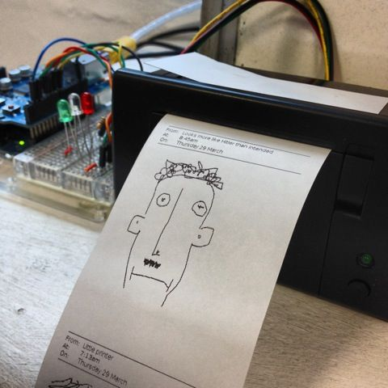
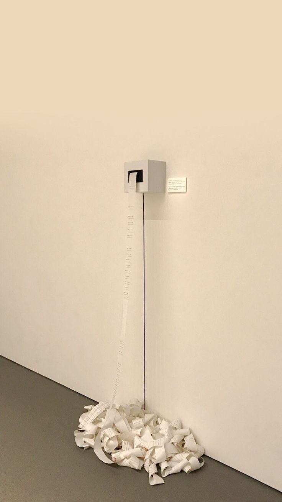
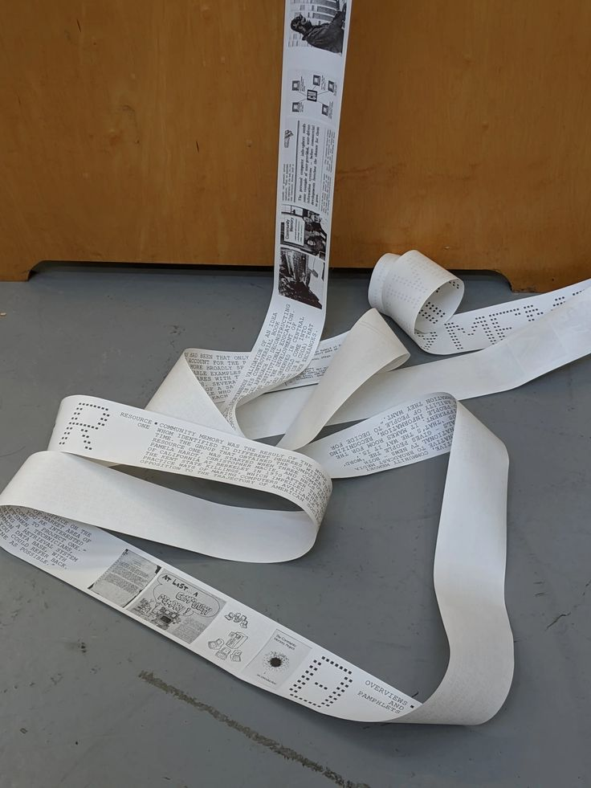

# Idea
Pretendo usar una transbank y adaptarla con un sensor IR que capte la presencia del espectador, aparte habría una cámara que registraría a quién está viendo,
esa imagen se pixelaría y se imprimiría. Además en la pantalla de la máquina saldría una frase, que vendría impresa con la foto pixelada.

La idea es hacer un recopilatorio de todas las personas que miren la obra, pero no tener su identidad.

También había pensado que estas fotos, en vez de estar pixeladas, se impriman dibujadas, pero eso sería mucho más complejo.

Referencias

